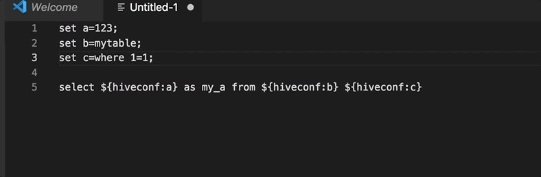
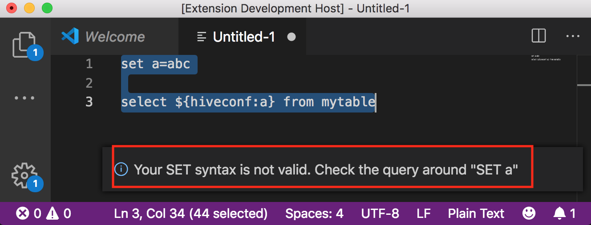
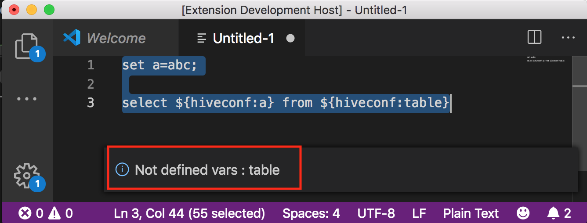

# What is this?

This is the extension to help your life with Hive/Spark SQL

## Features

### hiveconf resolver
You can replace all hive variable in your query.  

#### How to use
Select your query > `Cmd` + `shift` + `P` > Hiveconf resolver  

Also, you can validate your query.  
Your query must be valid, or you can see error below in your editor
- Case1) set query is not ended by semicolon.

- Case2) Some values are missing.

So you can validate and resolve hiveconf

# Known issues

# Release notes
## 0.0.1
- Support hiveconf resolver
## 0.0.2
- [Issue](https://github.com/dev-moonduck/vscode-ext/issues/1) that doesn't ignore SQL comment(`-- my comment`) is fixed
## 0.0.3
- [Issue](https://github.com/dev-moonduck/vscode-ext/issues/1) that doesn't ignore C-style block comment(`/* some mention */`) is fixed
- [Issue](https://github.com/dev-moonduck/vscode-ext/issues/4) that doesn't work when it has multiline declaration is fixed
- [Issue](https://github.com/dev-moonduck/vscode-ext/issues/8) that doesn't work when var value contains `$` sign
## 0.0.6
- [Issue](https://github.com/dev-moonduck/vscode-ext/issues/9) that doesn't work after extension's version upgrade to 0.0.3

# TODO
## hiveconf resolver
- Get text editor content and resolve(Now you must select your statement)

## Oozie parameter resolver
- Resolve all brace to proper value